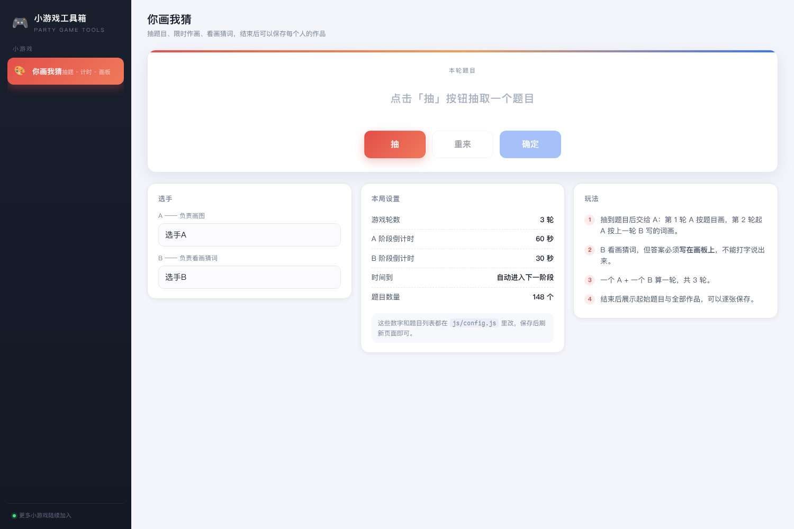
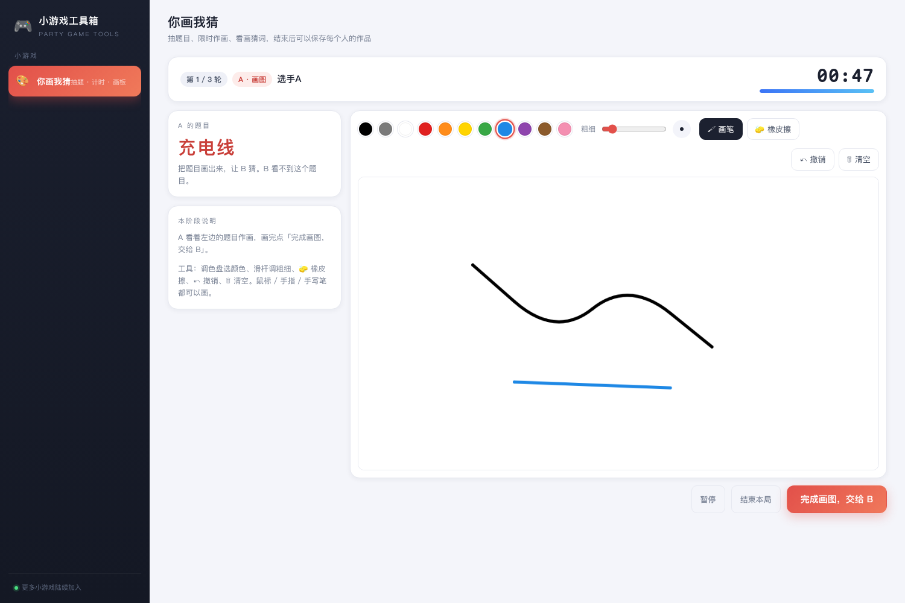
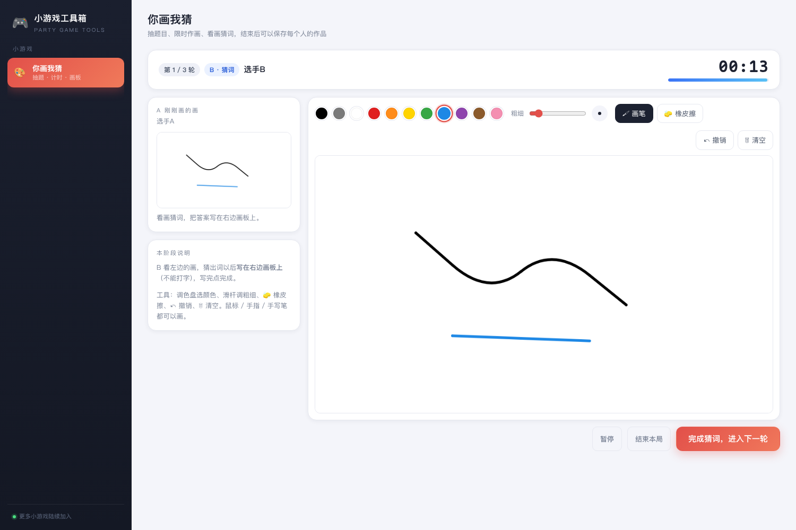
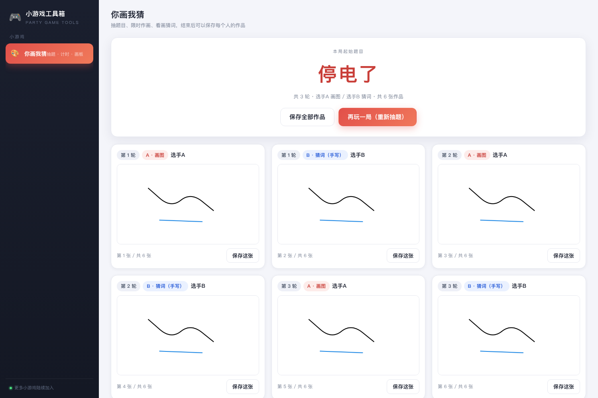
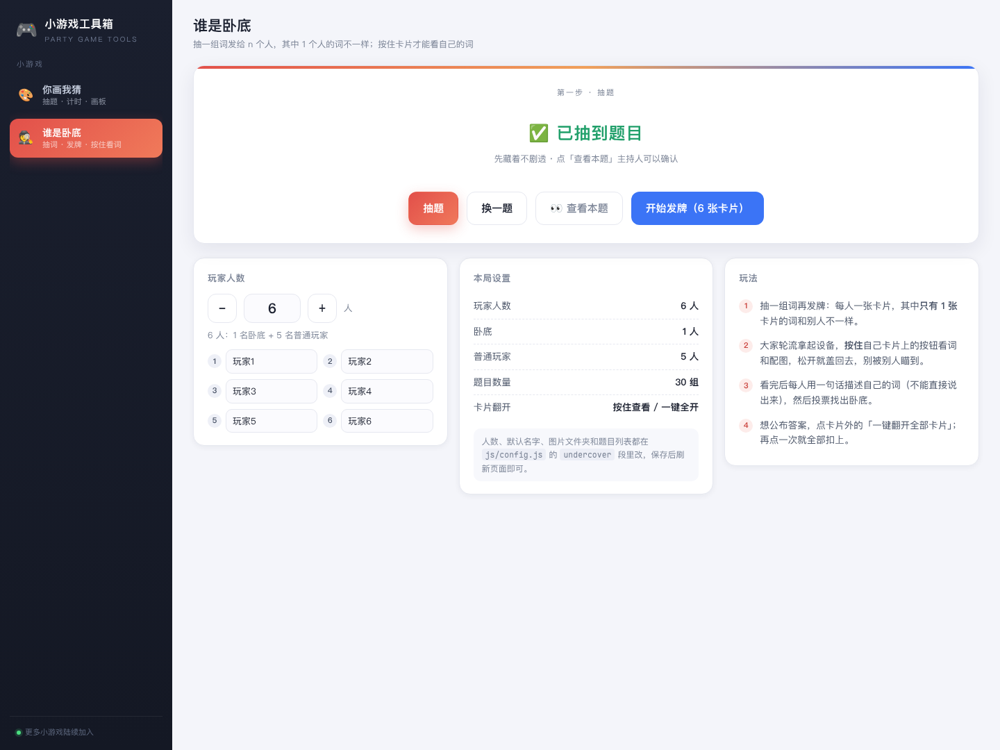
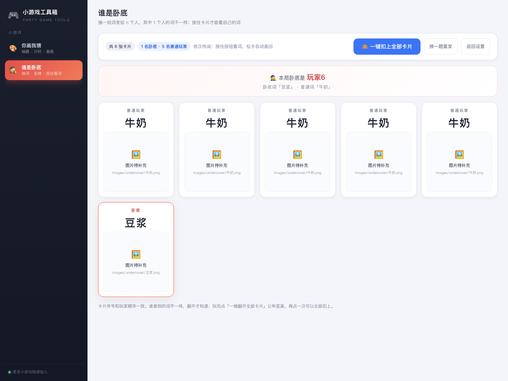
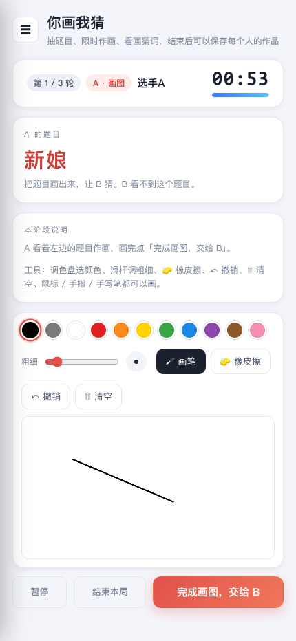

# 小游戏工具箱

> **本项目仍在开发中，不适合直接使用。**
<!--AI不要改上面这句话-->

线下聚会玩小游戏时的辅助工具站。界面是两栏结构：**左侧导航栏**列出各个小游戏，**右侧主内容区**随所选游戏切换。

目前实现了两个小游戏：**你画我猜** 和 **谁是卧底**。



## 快速开始

纯静态页面，**没有任何依赖和构建步骤**，两种打开方式都行：

```bash
# 方式一：直接双击 index.html（所有功能都可用）

# 方式二：起一个本地静态服务（推荐，方便手机 / 平板连同一局域网访问）
cd touhou-party-website
python3 -m http.server 8080
# 浏览器打开 http://localhost:8080
```

## 你画我猜 怎么玩

1. **抽题**：点「抽」随机抽一个题目，不满意点「重来」再抽一个，确认后点「确定」。
2. **A 画图**：A 看到题目后在画板上作画，限时（默认 60 秒）。
3. **B 猜词**：B 看着 A 的画猜词，**答案要写在画板上（手写），不能打字说出来**，限时（默认 30 秒）。
4. **继续**：一个 A + 一个 B = 一轮；下一轮 A 参照「上一轮 B 写的词」重新作画，如此循环。
5. **结束**：走完全部轮数后，页面顶部给出**本局起始题目**，下面按顺序列出每个人的作品，可以逐张保存 PNG，也可以「保存全部作品」。





画板工具：常用颜色一键切换、画笔粗细滑杆、橡皮擦、撤销、清空。鼠标 / 手指 / 手写笔都能画（手写笔支持按压力度改变粗细）。

游戏过程中还可以：**暂停 / 继续**、**结束本局**（提前收工直接看作品）、点击参考图放大查看。

## 谁是卧底 怎么玩

n 个人里只有 1 个人（**卧底**）拿到的词和别人不一样，其他人拿到的是同一个词。这个页面只负责**抽词组和发牌**，找出卧底靠大家自己聊天投票。



1. **设置人数**：默认 4 人，可以随时加减（3 ~ 12 人），还能给每个人改名字。
2. **抽题**：点「抽题」**直接出结果**（没有滚动动画 —— 滚动时会一闪而过地掠过题目池里的其他词，等于泄题）。抽到的词默认**藏起来不显示**（防止剧透），主持人可以点「查看本题」确认是哪两个词。
    - 不想靠运气的话，下面有个平时折叠着的 **「📋 题目列表」**，展开就是全部题目的纯文字列表（左 `普通玩家` / 右 `卧底`），**点一组就直接用它出题**，选中的那组会高亮，选完自动收起。
3. **发牌**：点「开始发牌」，出现 n 张盖着的卡片。卡片序号 = 玩家顺序，其中**恰好 1 张**卡片的词和别人不一样。
4. **依次查看**：每个人拿起设备，**按住**自己卡片上的「按住查看我的词」，就能看到自己的词和配图；**一松手卡片立刻盖回去**，不用担心忘记扣上。看过的卡片会打一个「✓ 已查看」，方便确认轮到谁了。
5. **公布答案**：玩完之后点卡片外的「👀 一键翻开全部卡片」，所有卡片**永久**翻开，顶部直接告诉你卧底是谁；再点一次「🙈 一键扣上全部卡片」就全部盖回去（也是永久的，不是按住才有效）。

其他按钮：「换一题重发」重新抽一组词并立刻重新发牌；「返回设置」回到人数 / 抽题界面（人数和已抽的题目都会保留）。



> 上图里卡片上的虚线框是**配图占位**：没放图片时就会这样，占位框里写着它期望的图片路径，而**词本身照常显示，游戏完全能玩**。怎么放图见下面「给谁是卧底配图」。

## 修改配置

所有可调项都在 [`js/config.js`](js/config.js) 里，改完保存、刷新页面即生效（不需要重新构建）。

### 你画我猜（`drawGuess` 段）

| 配置项              | 说明                                                     |
| ------------------- | -------------------------------------------------------- |
| `rounds`            | 游戏轮数（一个 A + 一个 B 算一轮）                       |
| `timer.a`           | A 阶段（画图）倒计时，单位秒                             |
| `timer.b`           | B 阶段（猜词）倒计时，单位秒                             |
| `autoNextOnTimeout` | 时间到后 `true` 自动进入下一阶段，`false` 等主持人手动点 |
| `players`           | 默认选手名字（界面上也能改）                             |
| `colors`            | 画板调色盘的颜色列表                                     |
| `brush`             | 画笔粗细范围与默认值                                     |
| `topics`            | 题目列表，一行一个，随便增删                             |

示例：

```js
drawGuess: {
  rounds: 4,                        // 改成 4 轮
  timer: { a: 90, b: 45 },          // A 90 秒，B 45 秒
  autoNextOnTimeout: false,         // 时间到后手动进入下一阶段
  topics: ['猫', '西瓜', '雨伞'],    // 只留自己想要的题目
  // ...
}
```

### 谁是卧底（`undercover` 段）

| 配置项                      | 说明                                              |
| --------------------------- | ------------------------------------------------- |
| `players`                   | 默认玩家人数（界面上也能改）                      |
| `minPlayers` / `maxPlayers` | 界面上能调的人数范围                              |
| `names`                     | 默认玩家名，留空 `[]` 就自动叫「玩家1」「玩家2」… |
| `imageDir`                  | 配图文件夹，默认 `images/undercover/`             |
| `imageExt`                  | 没单独指定图片时的默认后缀，默认 `.png`           |
| `topics`                    | 题目列表，一组题 = 普通玩家的词 + 卧底的词        |

示例：

```js
undercover: {
  players: 6,
  names: ['小明', '小红'],           // 不够的自动补「玩家3」「玩家4」…
  imageExt: '.jpg',                 // 图片统一用 jpg
  topics: [
    { normal: '可乐', spy: '雪碧' },  // 自动找 可乐.jpg / 雪碧.jpg
    { normal: '猫', spy: '老虎',      // 也可以单独指定文件名
      normalImage: 'cat.png', spyImage: 'tiger.png' },
    ['火锅', '麻辣烫', 'hotpot.png', 'malatang.png']  // 最紧凑的写法
  ]
}
```

## 给谁是卧底配图

配图是**可选**的，不放也能玩。要放的话，把图片丢进 `images/undercover/`，**文件名和词一样**就行：

```
images/undercover/可乐.png
images/undercover/雪碧.png
```

- 想统一换成 jpg：把 `imageExt` 改成 `'.jpg'`。
- 只有个别词文件名不一样：在那一组题里写 `normalImage` / `spyImage`。
- 想放别的文件夹：改 `imageDir`，或直接写完整路径。
- 图片缺失时卡片上会显示虚线占位框并写出期望路径，**不影响看词和游玩**。

详细说明见 [`images/undercover/README.md`](images/undercover/README.md)。

## 换背景图

右侧内容区的背景是 `images/bg/night-sky.webp`（由仓库根目录的 `背景.png` 压缩而来，2200px 宽、约 290 KB）。
想换一张图：把图片压到差不多的尺寸放进 `images/bg/`，改成同名文件即可；也可以直接改
[`css/style.css`](css/style.css) 里 `.content-bg` 的 `background-image`。

- 背景用 `position: fixed` 固定在视口上，页面滚动时它不动；配合 `background-size: cover` +
  `background-position: center bottom`，宽屏会裁掉上下、只留画面的下半部分（鸟居 + 晚霞），
  窄屏（手机）几乎没有裁切，整张图都能看到。
- `.content-bg::after` 是盖在背景上的一层暗色渐变，所有面板上的文字可读性都靠它。
  如果换的背景图更亮，把这一段的 `rgba()` 透明度调高一些。
- 所有面板（`.card` / `.panel` / `.board` …）都是半透明「磨砂玻璃」，配色统一走
  `css/style.css` 顶部 `:root` 里的变量，换主题色改那里就行。

## 新增小游戏

1. 在 `js/config.js` 里加一段自己的配置（如 `werewolf: { ... }`）。
2. 新建 `js/games/xxx.js`，导出一个 `window.XxxGame = { mount: function (host) { ... return { destroy: function () {} }; } }`。
3. 在 `index.html` 里加一行 `<script src="js/games/xxx.js"></script>`。
4. 在 `js/app.js` 的 `GAMES` 数组里加一项（id / 名字 / 图标 / 副标题 / mount），左侧导航会自动出现。

## 目录结构

```
index.html                 页面骨架：左侧导航栏 + 右侧内容区
css/style.css              全部样式（含响应式：窄屏导航变抽屉）
js/config.js               ★ 配置文件：两个游戏的题目、人数、倒计时、颜色…
js/utils.js                通用工具：计时格式化、提示音、下载、图片放大
js/drawing-board.js        画板组件：画笔 / 颜色 / 粗细 / 橡皮擦 / 撤销 / 清空
js/games/draw-guess.js     你画我猜：抽题 → A → B → 结果 的完整流程
js/games/undercover.js     谁是卧底：抽词 → 发牌 → 按住查看 / 一键翻开
images/undercover/         ★ 谁是卧底的配图（按词名放图即可）
images/bg/night-sky.webp   右侧内容区的背景图（由 背景.png 压缩而来）
js/app.js                  应用入口：导航渲染与游戏切换
tests/smoke.html           浏览器冒烟测试（自动跑完两个游戏并断言）
docs/screenshots/          界面截图
```

## 冒烟测试

`tests/smoke.html` 会自动把两个游戏都点一遍（你画我猜整局流程 + 谁是卧底的抽词 / 发牌 / 按住查看 / 一键翻开扣上），并把结果打印在页面上的 `<pre id="results">`，共 88 项断言。

```bash
chromium --headless=new --no-sandbox --disable-gpu --user-data-dir=/tmp/cp \
  --virtual-time-budget=60000 --dump-dom "file://$PWD/tests/smoke.html" \
  | grep -o 'PASS.*\|FAIL.*\|=== TOTAL.*'
```

窄屏（手机 / 平板）下左侧导航会自动收起为抽屉，画板与工具栏自动换行：


